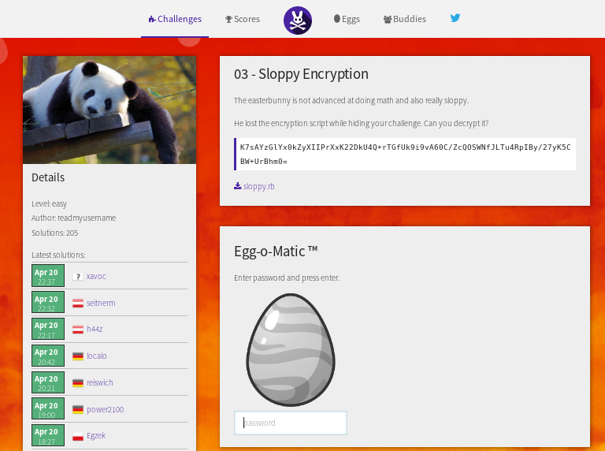

## 03 - Sloppy Encryption

From my point of view as a beginner,
this was a really fun and tricky challenge :)

So you are given a string of a total of 80 individual 
characters ending with a " = " Symbol.

voilá: 
* K7sAYzGlYx0kZyXIIPrXxK22DkU4Q+rTGfUk9i9vA60C/ZcQOSWNfJLTu4RpIBy/27yK5CBW+UrBhm0=

and most importantly a sloppy.rb file which apparently holds the encryption logic implemented in
the programming language ruby !:)



I decided to tackle this challenge by stepwise disecting the ruby code and to see what each 
ruby statement does with a given input.

The "lost" ruby script in question:
```
require"base64"
puts"write some text and hit enter:"
input=gets.chomp
h=input.unpack('C'*input.length).collect{|x|x.to_s(16)}.join
ox=('%#X' % (h.to_i(16)))
x=ox.to_i(16)*(['5'].cycle(101).to_a.join.to_i)
c=x.to_s(16).scan(/../).map(&:hex).map(&:chr).join
b=Base64.encode64(c)
puts"encrypted text:""#{b}"
```

I used a test input: "haha"

Starting with `input=gets.chomp` gets.chomp removes the line break read by gets

`h=input.unpack('C'*input.length).collect{|x|x.to_s(16)}.join`

Then the .unpack method is called which apparently seems to convert the individual
string characters into their ASCII decimal value (e.g character'a' to decimal 97)
& the individual number "collected" is converted to a string
#hexadecimal via .to_s(16) and joined to an single string via the .join method

`ox=('%#X'%(h.to_i(16)))`

this line of code, basically seems to add 0X to the start of the string which
is converted into an int via ".to_i()"
puts "hey ox #{ox}" # hex -> 0X68616861 which is 1751214177 in decimal

`x=ox.to_i(16)*(['5'].cycle(101).to_a.join.to_i)`

This step was probably the hardest to understand properly.
.to_a() -> to "array"
Returns the result of interpreting leading characters
in str as an integer base base (between 2 and 36).
so: "0a".to_i(16) -> 10, and 10.to_s(16) -> a, leading zero is missing

This statement apparently
takes the given number and ADDS a 5 to the end of that number !

```
y = ox.to_i(16)*['5'].to_a.join.to_i
puts "#{y}" # decimal
```

`z = y/['5'].to_a.join.to_i`

sort of the revese function from above
however there is 1 decimal place missing ?

---------------------------------------------------

### Reverse writing the ruby script

The secret string "haha" which I entered in the sloppy.rb script
was encrypted to 
`KWzxE6JKUr9Z1hvmje9CIt9mB3huk7BBNxuhAYixQst8H///////////xgLGAw==`

I decided to just start from the end of the encryption script and turn 
things around :)

`enB = Base64.decode64(str)`
And to start things of I would first decode the string from Base64.

Next the ruby scan(/./) splits the string into desired array format
and .map(&:ord) converts from char code into hexadecimal and
.collect{ |num| "02X" % num} converts from dec to char

`ah = enB.scan(/./).map(&:ord).collect{|num| "%02X" % num}.join`
